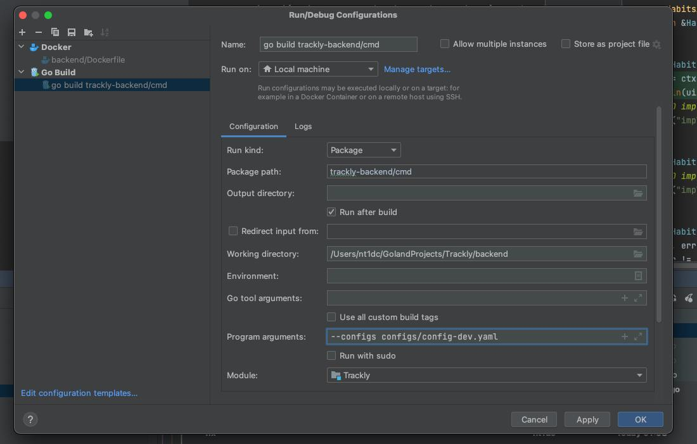
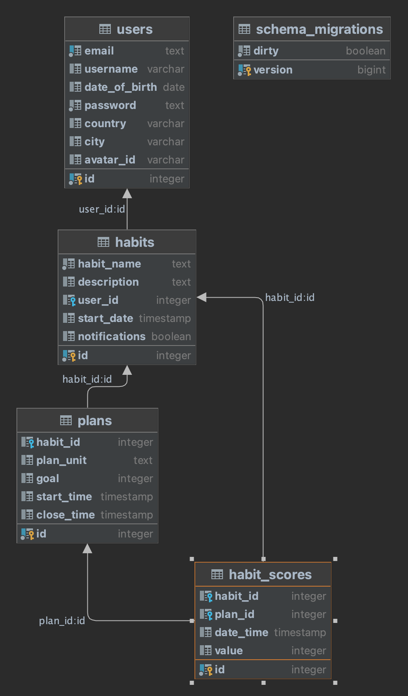

# Trackly Backend

## [Spec](open-api/openapi.yaml)

# Local debug

## Codegen
используется кодогенерация ручек по опен апи схеме [openapi.yaml](open-api/openapi.yaml)


Устанавливаем зависимости
```bash
go install github.com/oapi-codegen/oapi-codegen/v2/cmd/oapi-codegen@latest
```
Генерим коды
```bash
oapi-codegen -generate client,types,server -package api open-api/openapi.yaml > internal/api/api.gen.go
```

Запуск баз данных из корня
```bash
docker-compose up minio postgres-trackly-bd -d
```

Конфигурация для дебага



## Locations
Backend

http://localhost:8080

Postgres

localhost:5432

Mino Web Ui

http://127.0.0.1:9001

## BD schema

